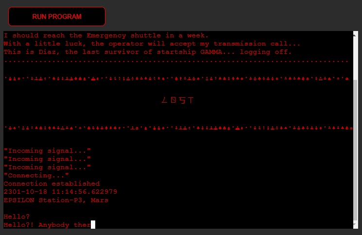
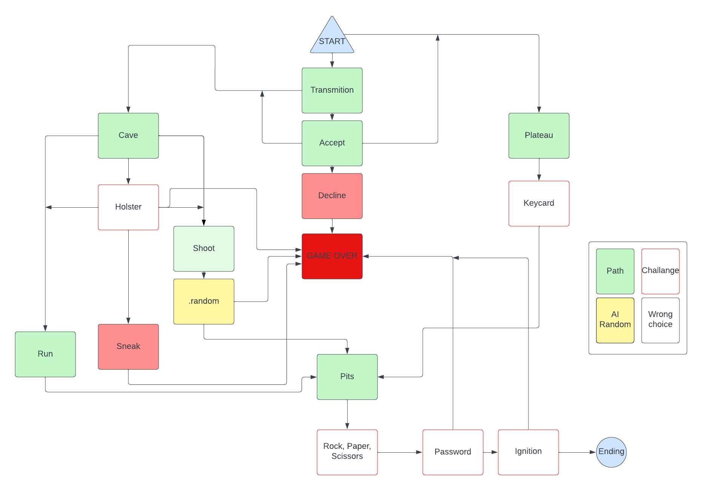
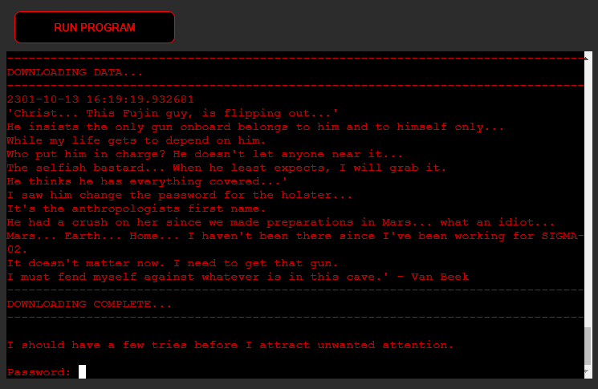
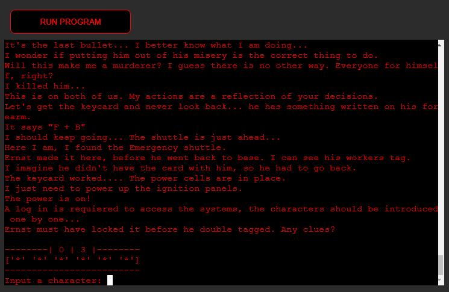
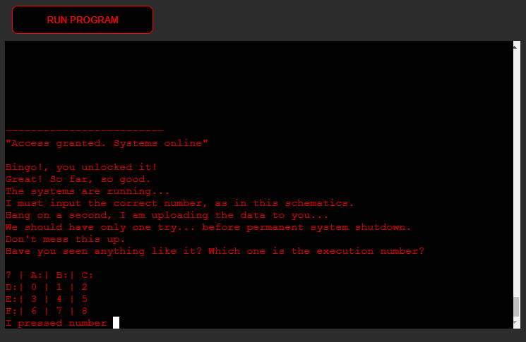
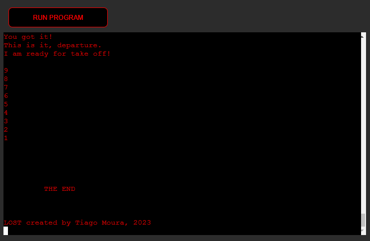
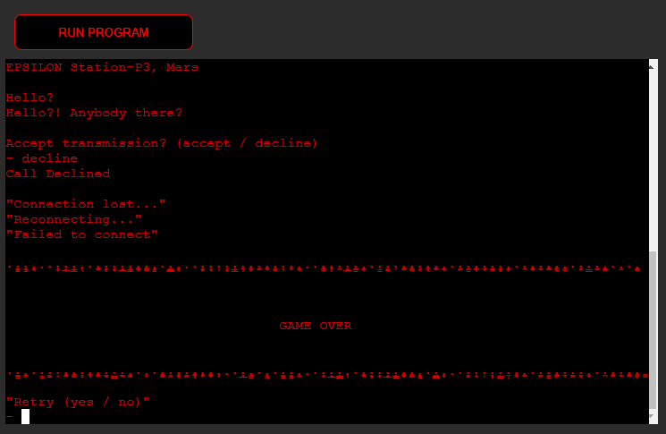
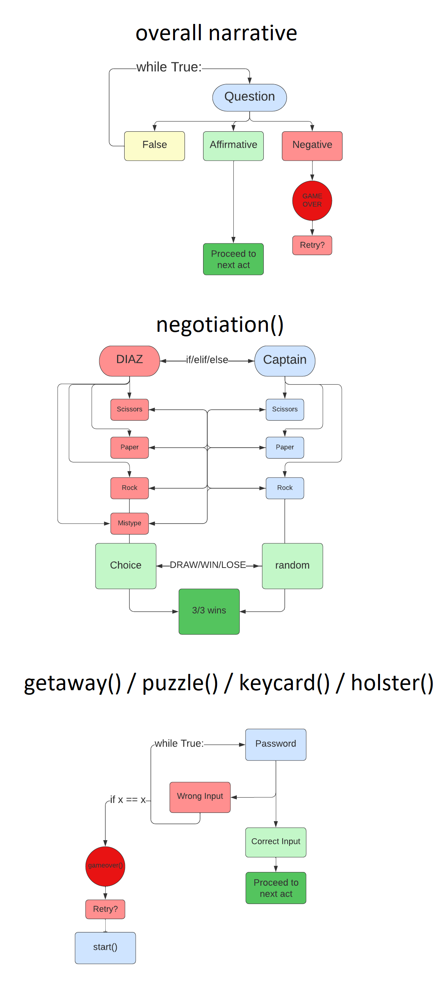

# LOST
'LOST' is an interactive text-based adventure game, where users get to read and interact with the narrative of this app.
Users are prompt to make choices and solve puzzles along the way. The plot follows a non-linear story, where the main character requires input from the user in order to progress through the story.

This app is targeted to people looking for an interactive narrative, similar to the late 70s computer games (example Zork).

# Live Project
- The live project can be found [here](https://lost-rpg.herokuapp.com/)

# Development Process
## Python
The app was designed with the intend to give users a non-linear experience, where different paths would lead to different puzzles and therefore different outcomes.

The game started out as a very ambitious project, with multiple routes to be taken upon, that would break into varied tree braches and puzzles to be solved and that would eventually offer replayability to the users, after multiple endings.
In the end, this project was shortened into smaller scale, due to time consumption, dateline limitations and hard conciliations.
It makes good use of familiar concepts that were taught throughout the Python and JavaScript modules, such as Built-in modules, Functions, if/elif/else, Classes, Lists, While Loops, etc.
Upon creating this project, the developer resorted ["Interactive Fiction(IF)"](https://en.wikipedia.org/wiki/Interactive_fiction) as main inspiration for its development, where the user must input text in order to insteract with the storyline.

# Goals
## User Experience
- To explore the narrative and experience the different paths the app has to offer.
- To interact with the AI via text.

## Developer Goals
- To develop a non-linear and interactive Role Playing text-based game, where users get to face multiple challenges every new run.
- To simulate Artificial Intelligence and responsiveness, when a challence is prompt.

# Features
- The narrative starts with and introduction to the game.
- It feautures a title and prompts the User to ither accept or decline the call.
- If the call is accepted the game proceeds to ask the User for a name. If by chance the User declines the call it's Game Over.
- The game resumes the storyline, where the User ust make a choice between 2 main paths, of which incorporates choices and challenges throghout the journey.
- During the narrative, clues are given for the user to find in order to complete disputes, one should encounter during the game.
- The user will also find routes that are determined by the random module. This prompts the user to go to the next act, based on luck, if the wrong path was taken.
- If the User chose the correct path and beat all challenges, one shall be presented with the Endind.
- Upon Game Over, the user is greeted with a Retry message. If, by agreeing to this, the user is taken back to the begining of the narrative, as a form of punishment. 
- The plost guides the User to solve puzzles and engage is challenges such as determining a password via Hangman, playing Rock/Paper/Scissors or answering a Riddle.
- An Audio player was created, for an atmospheric climate.
- A "Run Program" button si accessible for the User to reset the script from the start.(Default function, developed by Code Institute)

# Missing features I wish to add:
- More paths, options and choices, more responsiveness to consequences, more puzzles and more dynamic endings, based on good or bad choices choices.

# Styling
- The text for the app makes good use of the Colorama module, Sys and Time. Ergo, the text was stylized to the color Red, giving a dark and retro-futuristic look to it.
- Furthermore, a typewritting effect was produced to give the reader the illusion of suspense, when interacting with character Diaz.
- Moreover, the title "LOST" was stylized with ASCII characters.
- The style for the HTML file was also updated. The Button was stylized with colors matching the terminal and the white background turned into dark gray, as the original contrast between the Terminal and HTML was too bright.

# Python and Logic
The app follows the basic rules of Interactive Fiction where the User must read the text presented beforehand, and make a decision. For each choice, the User is dealt with a selection of choices, that will lead to a new result. Based on the outcome, the journey will exhibit new choices. During the course of the story, the User must perform certain tasks in order to progress to the next act.

- while True - This loop was applied for most of the functions as a form of making a coherent decision, in order to prevent a broken outcome. It only lets the user escape the loop and progress to the next block of code, if and only once a delineated choice is given.
- functions - The app was developed and structured by creating and calling functions. This made the code easier to read, accessible and pleasently organized, when blocks of code are exectued from the bottom to the top.
- if/elif/else - These staments gave the possibility for the user to make choices that would also lead to consequences. Most of the plot ended with these statements as a form of a non-linear narrative.
- classes - The usage of a class was implemented to make great use, as an example of, the power it brings when creating multiple profiles.
- lists - Were used to create puzzles, such as the negotiation() and getaway() function. This enabled the possibility to raffle a choice, with the random module, within the lists. It also gave the illusion of pressing a button in the terminal for getaway().

The challenges can be more or less defined as follows:

## Modules
The following modules were imported to achieve the desired responsiveness.
- datetime/timedelta - Used to apply real time + additional days(years)
- colorama/Fore - Used to stylize the color of the text
- time - Used to slow/sleep paragraphs
- sys - Used to manipulate different the runtime environment
- random - Used to raffle choices within a list

# Assay
## Testing
- Testing was manually perfomed by trying every possible route in the narrative and possible answers & mistakes within a piece of block of code.
- All functions are invoked in accordance to each act and respond accordingly without any errors whatsoever.
- Testing was also perfomed on run.py, using the [CI Python Linter](https://pep8ci.herokuapp.com/), errors have been identified and solved.

# Technologies
## Languages
The app was written under the Backend programing language "Python".
- Python - Structure, Style and Logic of the app

## Other forms of development as follows:
- [Programiz](https://www.programiz.com/python-programming/online-compiler/) - Online compiler (Used to test functions and batches of code separatly)
- [Patorjk](https://patorjk.com/software/taag/#p=display&f=Graffiti&t=Type%20Something%20) - ASCII Art Generator
- [Lucidchart](https://www.lucidchart.com/) Mapping Charts application
- [CI Python Linter](https://pep8ci.herokuapp.com/) CI Python testing tool
- [Github](https://github.com/) - Host for the repository
- [Gitpod](https://gitpod.io/) - Code editor
- [Heroku](https://id.heroku.com/) - Cloud platform/Host the live project

## Development & Deployment
The project was developed using GitHub and GitPod platforms.

- Navigate to: "Repositories" and create "New".
- Mark the following fields: ✓ Public ✓ Add a README file.
- Select template: "Code-Institute-Org/python-essentials-template".
- Add a Repository name: "lost".
- And create Repository.

This project was developed using GitPod and suffered various executions using the inbuild Terminal.
- git add . - Command used before commiting.
- git commit -m "written imperative declaration" - Command used to declare changes and updates.
- git push - Command used to push all updates to the GitHub Repository and live version.
- python3 run.py - Command used to load the website on the in-built Terminal.

The website was deployed via Github:
- Under the given Repository, navigate to "Settings".
- Navigate to "Pages" from the left-hand bar.
- From here the "Source" should be set to "Deploy from branch".
- On "Branch" select "main" and save.
- The app was deployed via Github and the repository can be found [here](https://github.com/TiagoMA90/lost).

...and hosted on Heroku:
- After creating an Heroku Free account, and applying for Student Pack
- Navigate to: "Create new app" add a unique name "lost-rpg" and select "Europe" region. Clikc "Create App"
- Head over to "Settings" tab and add the Buildpacks "python" & "nodej" (in this order)
- Move to "Deploy" section and select "Github" method"
- From here search for the repository name "lost", from the GitHub account.
- Hit "Connect" and "Enable Automatic Deploys" to keep the the repository in parallel to Heroku.
- Manually "Deploy Branch".
- The "Buildmaster" installs "python" followed by "nodejs".
- Upon successful deployment, retrieve the link for the mock terminal.
- The live app can be found [here](https://lost-rpg.herokuapp.com/).

## NOTES (Spoiler!) Roadmap, Solutions for the Assessor:
- Below are the solutions for the game, as it might be tedious to be testing the game over and over

      ... -> Accept Transmisstion -> [accept] -> ...
                                 -> [decline] -> game over

         ... -> What is your name? -> [input a name] -> ...

         ... -> Stay online? -> [yes] -> ...
                                [no]  -> game over

            ... -> cave -> Password for the Holster: [emma]  -> ...
                           Password for the Holster: mistype -> game over

                   ... -> cave encounter -> [run]   -> ...
                   ... -> cave encounter -> [sneak] -> game over
                   ... -> cave encounter -> [shoot] -> random -> ...
                                                              -> game over
                                                              
            ... -> plateau -> Password for the Keycard: [virgo] -> ...
                           -> Password for the Keycard: mistype -> game over

                  ... confront the Captain(gun): [shoot]    -> ...
                                                 [threaten] -> [shoot] -> ...
                                                               [trade] -> ...

                  ... confront the Captain(keycard): [Rock/Paper/Scissors] -> random -> win  -> ...
                                                                                        lose -> game over

                     ... Solve the enigmatic word: [python] -> ...
                                                    mistype -> game over

                        ... -> Input the number in schematics: [7] -> end
                                           anything other than "7" -> game over

# Credits
The following sources were resorted in the creation of this website:

- [Code Institute](https://learn.codeinstitute.net/dashboard) was used as guidance platform for the development of this project (Python Module).
- [freeCodeCamp](https://www.youtube.com/watch?v=rfscVS0vtbw) was used as orientation platform for the development of this project (Python beginner course).
- Audio originally from "The Thing(1982)" composed by Ennio Morricone - "Humanity (Pt. 2)", exctracted from [here](https://www.youtube.com/watch?v=I9Doo9ajCyQ) and applyed to the body of this app
- stackOverflow was used as a solution platform for broken code.