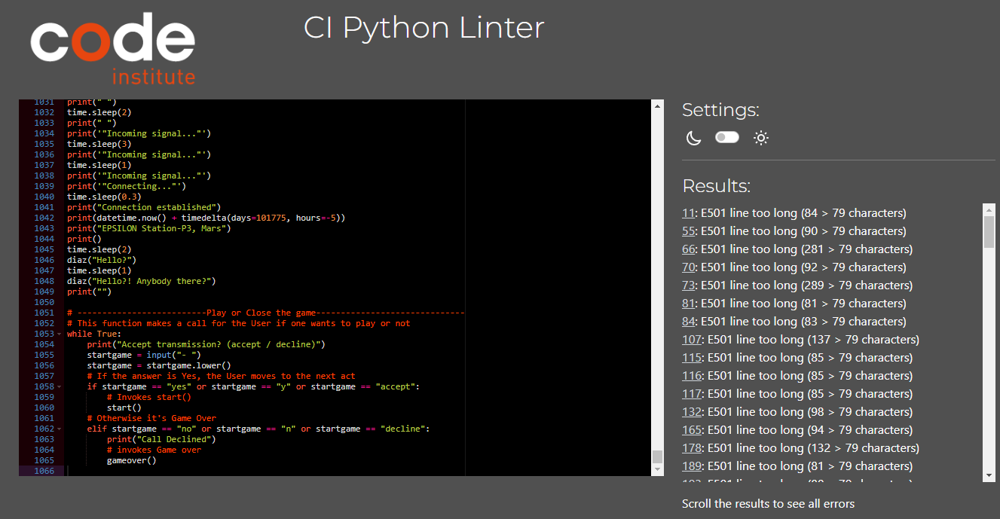

# LOST
'LOST' is an interactive text-based adventure game, where users get to read and interact with the narrative of this app.
Users ar eprompt to make choices and solve puzzles along the way. The plot follows a non-linear story, where the main character requires input from the user in order to progress through the story.

This app is targeted to people looking for an interactive narrative, similar to the late 70s computer games (example Zork).

# Live Project
- The live project can be found [here](https://lost-rpg.herokuapp.com/)

# Development Process
## Python
The app was designed with the intend to give users a non-linear experience, where different paths would lead to different puzzles and therefore different outcomes.

The game started out as a very ambitious project, with multiple routes to be taken upon, that would break into varied tree braches and puzzles to be solved and that would offer replayability to the users.
Eventually this project was shortened into a smaller scale, due to time consumption, date limitations and hard conciliations.
It makes good use of familiar concepts that were taught throughout the Python and JavaScript modules, such Built-in modules, Functions, if/elif/else, Classes, Lists, While Loops, etc.
Upon creating this project, the developer resorted ["Interactive Fiction(IF)"](https://en.wikipedia.org/wiki/Interactive_fiction) as main inspiration for its development, where the user must input text in order to interact with the storyline.

# User Experience
- To explore the narrative and experience the different paths the app has to offer.
- To interact with the main character via text.

# Developer Goals
- To develop a non-linear and interactive Role Playing text-based game, where users get to face multiple challenges every new run.
- To simulate Artificial Intelligence, when a challence is prompt.

# Features
- The narrative features 2 paths, of which incorporates choices and challenges throghout the journey.
- It features a selection of functionalities such as the possibility to give in the Users name, make a choices, that will eventually determine which path the main character will take.
- During the narrative, clues are given for the user to find in order to complete challanges, one should encounter during the game.
- The user will also find routes that are determined by the random module. This prompts the user to go to the next act, based on luck, if the wrong path was taken.
- Upon Game Over, the user is greeted with a Retry message. If, by agreeing to this, the user is taken back to the begining of the narrative, as a form of punishment.
- The plost guides the User to solve puzzles and engage is challenges such as determining a password via Hangman, playing Rock/Paper/Scissors or answering a Riddle.

# Styling
- The text for the app makes good use of the Colorama module, Sys and Time. Ergo, the text was stylized to the color Cyan, giving a dark and retro-futuristic look to it.
- Furthermore, a typewritting effect was produced to give the reader the illusion of suspense, when interacting with character Diaz.
- Moreover, the title "LOST" was stylized with ASCII characters.
- The style for the HTML file was also updated. The Button was stylized with colors matching the terminal and the white background turned into dark gray, as the contrast between the app was too bright.

# Python and Logic
- while True - This loop was applied for most of the functions as a form of making a coherent decision, in order to prevent a broken outcome. It only lets the user escape the loop and progress to the next block of code, if and only once a given choice is given.
- functions - The app was developed and structured by creating and calling functions. This made the code easier to read, accessible and pleasently organized, when blocks of code are exectued from the bottom to the top.
- if/elif/else - These staments gave the possibility for the user to make choices that would also lead to consequences. Most of the plot ended with these statements as a form of a non-linear narrative.
- classes - The usage of a class was implemented to make great use, as an example of, the power it brings when creating multiple profiles.
- lists - Were used to create puzzles, such as the negotiation() and getaway() function. This enabled the possibility to raffle a choice, with the random module, within the lists. It also gave the illusion of pressing a button in the terminal.

## Modules
- datetime/timedelta - Used to apply real time + additional days(years)
- colorama/Fore - Used to stylize the color of the text
- time - Used to slow/sleep paragraphs
- sys - Used to manipulate different the runtime environment
- random - Used to raffle choices within a list

# (UPDATE)Assay
## Testing
- Testing was manually perfomed by trying every possible route in the narrative and possible choices and mistakes within a piece of block of code.
- All functions are invoked in accordance to each act and respond accordingly without any errors whatsoever.
- Testing was also perfomed using the [CI Python Linter](https://pep8ci.herokuapp.com/), errors have been documented and solved with the exception of:
  - "X: E501 line too long (x > 79 characters)" As long lines are an essential feauture for the narrative of this project.

# Technologies
## Languages
The app was written under Backend programing language "Python".
- Python - Structure, Style and Logic of the app

## Other forms of development as follows:
- [Programiz](https://www.programiz.com/python-programming/online-compiler/) - Online compiler (Used to test functions and batches of code separatly)
- [Github](https://github.com/) - Host for the repository
- [Gitpod](https://gitpod.io/) - Code editor
- [Heroku](https://id.heroku.com/) - Cloud platform/Host the live project

## Development & Deployment
The project was developed using GitHub and GitPod platforms.

- Navigate to: "Repositories" and create "New".
- Mark the following fields: ✓ Public ✓ Add a README file.
- Select template: "Code-Institute-Org/python-essentials-template".
- Add a Repository name: "lost".
- And create Repository.

This project was developed using GitPod and suffered various executions using the inbuild Terminal.
- git add . - Command used before commiting.
- git commit -m "written imperative declaration" - Command used to declare changes and updates.
- git push - Command used to push all updates to the GitHub Repository and live version.
- python3 run.py - Command used to load the website on the in-built Terminal.

The website was deployed via Github:
- Under the given Repository, navigate to "Settings".
- Navigate to "Pages" from the left-hand bar.
- From here the "Source" should be set to "Deploy from branch".
- On "Branch" select "main" and save.
- The app was deployed via Github and the repository can be found [here](https://github.com/TiagoMA90/lost).

...and hosted on Heroku:
- After creating an Heroku Free account, and applying for Student Pack
- Navigate to: "Create new app" add a unique name "lost-rpg" and select "Europe" region. Clikc "Create App"
- Head over to "Settings" tab and add the Buildpacks "python" & "nodej" (in this order)
- Move to "Deploy" section and select "Github" method"
- From here search for the repository name "lost", from the GitHub account.
- Hit "Connect" and "Enable Automatic Deploys" to keep the the repository in parallel to Heroku.
- Manually "Deploy Branch".
- The "Buildmaster" installs "python" followed by "nodejs".
- Upon successful deployment, retrieve the link for the mock terminal.
- The live app can be found [here](https://lost-rpg.herokuapp.com/).